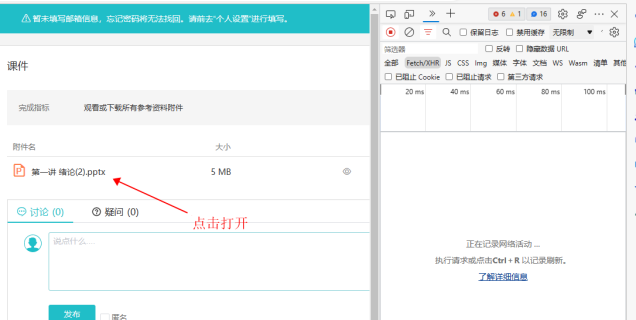
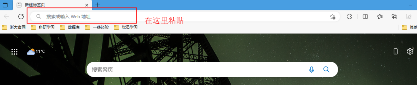
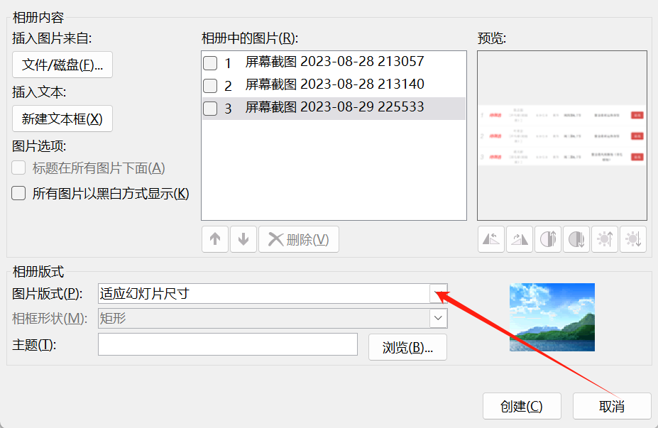

# 关于如何高效获取与分享学习资料
## 网页分享
??? 将网页保存为mhtml格式
    有时候我们需要将一些网页内容分享给朋友，如果这个网站需要账号登陆才能查看，将这个网页保存为html文件分享后，朋友因账号检测无法查看网页内容。  
    
    比如说我想把有机化学第六章测试这个网页内容分享出去，但如果直接ctrl+s保存分享，朋友会因为学在浙大的账号检测导致网页内容丢失，当然可以用Windows的网页捕获截取全屏（右上角三点——截图——捕获全页），但是一个长图片很难用，而且不能用ctrl+f等功能。   
    
    保存mhtml格式：   
    
    1.右键chrome快捷方式，选择快捷方式一栏，在目标输入框chrome.exe后加入空格和--save-page-as-mhtml，再重新打开chrome。
    
    
    
    2.在Chrome打开你要分享的网页，先完整浏览一遍页面，确保图片都加载出来了！（否则会有内容丢失），然后按ctrl+s，保存到桌面就ok啦，要分享给朋友的话直接把链接拖到聊天栏，就可以分享这个mhtml文件。

	
    
## 课件下载  

??? 如何下载学在浙大上老师没有开放权限的课件
    Solution1：使用ZLA软件（下载链接见软件分享）  
    
    Solution2：  
    
     1.网页打开学在浙大

     2.找到需要下载的课件

     3.用“Ctrl+Shift+I”或F12 打开“开发人员工具”；
    
    

     4.通过下图红框里的“》”或者“+”号，找到“网络”。并且保证绿色方框里为“正在记录网络活动”的状态（这个一般点击“网络”后就是开启的状态了，即蓝框里的按钮是亮的，万一有可能未开启的话，可以点击一下上面蓝框里的按钮）。
     
     

     5.点击打开需要下载的文件

     

     点击打开之后，如下图

     

     6.在右侧的一群链接里，找到url开头的一个链接

     

     7.点击url的链接后，最右侧的页面里，找到“预览”（这个之前用过的再次打开是可以直接看到，如果之前没用过，需要在“》”这个更多选项里找找看）。

     

     8.“预览”的页面上有一段url链接（如上图红框里）。复制双引号里面的内容，打开一个新的网页标签，在网址中粘贴刚刚复制的内容，按下“enter”键，即可下载课件成功。（有些浏览器按下“enter”键是打开课件，然后会有可以下载的标志，有些是按下“enter”键直接下载了）

     

??? 如何下载智云课堂上的课件
    首先说明，智云课堂是自带PPT导出，但是功能非常捞，因为智云课堂的视频时间简直乱标，有些ppt因为时间错位根本没扫描。就算时间正常，导出来之后的ppt存在空白空隙（虽然我感觉这主要是因为WPS PPT很捞）

    Solution：

    1.使用ZLA导出全部图片（设置里不要选择自动转为PDF，因为WPS内页数删除很麻烦，而且WPS PDF他妈的删除后保存还要会员）

    2.打开 Microsoft PointPoint  
    备注：如果电脑上没有Microsoft Office，直接去ZJUers轻首页-正版软件免费下载（注意区分Windows版本和Mac OS版本）  
    以及，这个下载完后桌面上不会出现快捷方式，可以在"开始"处找到

    3.接下来要做的就是在每一页导入一张图片，不要用“插入-图片”功能，这是在同一页导入图片。使用“插入-相册-新建相册”功能，导入所有图片，并在“图片版式”中选择“适应幻灯片尺寸”，点击“创建”。你就会惊奇地发现，你成功地把老师PPT从智云扒了下来，且图片完美填充页面。

    

    4.删除重复ppt，只保留完整页ppt（因为要转pdf）
    
    推荐操作：只用键盘 右手删除键（Backspace或Delete） 左手ctrl+z撤回误删的页面

