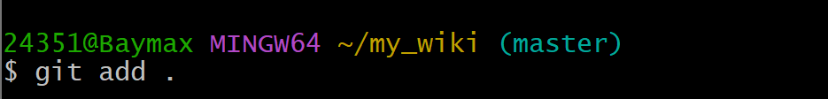

# Mkdocs+Github搭建网站

## 必要的前期准备
!!! 获得一个稳定的梯子
!!! 下载Gitbash
    Git bash与cmd一样都是Shell，但是Git bash的兼容性更好，两者功能是互补的。
    
    Git bash官方网站：[https://gitforwindows.org/](https://gitforwindows.org/)

!!! 拥有一个Github账号
    直接去Github官网注册就行，记住用户名。
!!! 下载VisualCode

## 下载pip（用于获取mkdocs）
!!! 在gitbash中完成
    详情见[https://www.runoob.com/w3cnote/python-pip-install-usage.html](https://www.runoob.com/w3cnote/python-pip-install-usage.html)

## 下载mkdocs
!!! 在gitbash中完成
    输入pip install mkdocs-material

##  创建本地文件夹，并进行本地网站浏览
!!! 在gitbash中完成
    1.输入mkdocs new name(name你自己取个名字就行)
    
    

    2.输入cd name(name就是你上面取的文件名字，cd表示进入文件)

    

    3.输入mkdocs serve，复制出现的网址信息，粘贴到浏览器访问即可看到预览信息   
    这个网站只能在本地查看，不能让别人看。

## 对mkdocs文件进行简单修改
!!! 在visualcode里完成
    1.打开你的文件夹，比如我就是打开my_wiki

    2.然后按照下图打开site文件里面的mkdocs.yml
    
    输入如下代码:  
    site_name: My Docs  
    repo_name: 你的Github用户名/你的仓库名  
    repo_url: https://github.com/你的Github用户名/你的仓库名

    

    3.打开index.md,输入  
    “# 这是我的第一个网站”（只用输入双引号内的内容）

## 在Github上创建仓库（从下面开始的所有操作都要梯子，不然网络不稳定）
!!! 在浏览器中完成
    1.进入github网站，点击右上方的头像

    2.点击Your repositories

    

    3.点击"New"

    

    4.命名你的仓库，记住你的仓库名。
    
    选择Public。
    
    创建仓库！

    

    5.点击"creating a new file"

    

    6.命名文件（随便命名）

    往文件里面随便打些东西

    Commit changes

    
    

## 进行github仓库远程连接
!!! 在gitbash中完成

    详情见[https://blog.csdn.net/qq_41234663/article/details/110645327](https://blog.csdn.net/qq_41234663/article/details/110645327)  
    步骤4选第二行那条

    这上面有些可能不太实用，下图是全流程
    
    

    

    
    
    如果出现这种错误，说明连接已经存在，按下图解决，没有则跳过下面两张图

    

    

    ————————————————————————————————————————————————————————————    
    
    

    出现以下Waring继续git add .即可，没有则跳过下面第一张图

    

    —————————————————————————————————————————————————————————————
    
    

    

    划线部分就是我们的网站，这个是可以允许他人浏览的。

    

